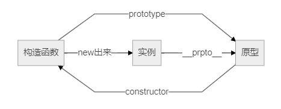

# 创建对象
创建单个对象：Object构造函数[new Object()]、对象字面量（参见5-1 Object 类型） <br>
创建多个对象：以下7种方式 <br>

## 1. 工厂模式
```js
function createPerson(name, age, job){
  var o = new Object();
  o.name = name;
  o.age = age;
  o.job = job;
  o.sayName = function(){
    alert(this.name);
  };
  return o;
}
var person1 = createPerson("Nicholas", 29, "Software Engineer");
var person2 = createPerson("Greg", 27, "Doctor");
```
优缺点： <br>
解决了创建多个相似对象的问题， <br>
没有解决对象识别的问题（即怎样知道一个对象的类型）。 <br>

## 2. 构造函数模式
```js
function Person(name, age, job){
  this.name = name;
  this.age = age;
  this.job = job;
  this.sayName = function(){
    alert(this.name);
  };
}
var person1 = new Person("Nicholas", 29, "Software Engineer");
var person2 = new Person("Greg", 27, "Doctor");
```
与 createPerson() 不同之处： <br>
-  没有显式地创建对象；
-  直接将属性和方法赋给了 this 对象；
-  没有 return 语句。

注意：函数名首字母大写。 <br>

创建 Person 的新实例，必须使用 `new` 操作符。 <br>
以这种方式调用构造函数实际上会经历以下 4 个步骤： <br>
*(1) 创建一个新对象；* <br>
*(2) 将构造函数的作用域赋给新对象（因此 this 就指向了这个新对象）；* <br>
*(3) 执行构造函数中的代码（为这个新对象添加属性）；* <br>
*(4) 返回新对象。* <br>

#### 将构造函数当做函数
任何函数，只要通过 new 操作符来调用，那它就可以作为构造函数； <br>
任何函数，如果不通过 new 操作符来调用，那它跟普通函数没什么两样。 <br>

#### 构造函数的问题
相比工厂模式优点：可以将构造函数的实例标识为一种特定的类型 <br>
主要问题：每个方法都要在每个实例上重新创建一遍 <br>
解决方法：将函数定义转移到构造函数外面，但是在全局作用域定义不合适，使用原型模式。 <br>

## 3. 原型模式
每个函数都有一个 prototype （原型）属性，这个属性是一个指针，指向一个对象。 <br>
用途：让所有对象实例共享它所包含的属性和方法。 <br>
```js
function Person(){
}
Person.prototype.name = "Nicholas";
Person.prototype.age = 29;
Person.prototype.job = "Software Engineer";
Person.prototype.sayName = function(){
  alert(this.name);
};
var person1 = new Person();
person1.sayName(); //"Nicholas"
var person2 = new Person();
person2.sayName(); //"Nicholas"
alert(person1.sayName == person2.sayName); //true
```

#### 理解原型对象
只要创建了一个新函数，就会根据一组特定的规则为该函数创建一个 **prototype** 属性，这个属性指向函数的**原型对象**。 <br>
在默认情况下，所有原型对象都会自动获得一个  **constructor**（构造函数）属性，这个属性包含一个指向  prototype 属性所在函数的指针。 <br>

创建了自定义的构造函数之后，其原型对象默认只会取得 constructor 属性；其他方法都是从 Object 继承而来的。 <br>

构造函数、原型、实例三者关系： <br>


`Person.prototype.constructor == Person` <br>

**isPrototypeOf()** 判断原型对象是否是实例的原型: <br>
`Person.prototype.isPrototypeOf(person1) // true` <br>

**Object.getPrototypeOf()** 获取实例的原型: <br>
`Object.getPrototypeOf(person1)` <br>
浏览器支持：IE9+、Firefox 3.5+、Safari 5+、Opera 12+ 和 Chrome。 <br>

读取某个对象的某个属性时，先从对象实例本身开始，找到了则返回；没找到则继续搜索原型对象。 <br>
==> 多个实例可以共享原型的属性和方法 <br>

**hasOwnProperty()** 检测一个属性是否存在于实例本身中（不在原型上） <br>
`person1.hasOwnProperty("name")` <br>

#### 原型与 in 操作符
使用 in 操作符的2种方式：单独使用 和 在for-in循环中使用。 <br>
- **key in object** <br>
单独使用时，in 操作符会在通过对象能够访问给定属性时返回 true，无论该属性存在于实例中还是原型中。 <br>

*判断属性是原型中的属性（不在实例上）： <br>
```js
function hasPrototypeProperty(object, name){
  return !object.hasOwnProperty(name) && (name in object);
}
```
-  **for (var key in object) { }** <br>
使用 for-in 循环时，返回的是所有能够通过对象访问的、可枚举的属性，其中既包括存在于实例中的属性，也包括存在于原型中的属性。 <br>

IE 早期版本 bug：屏蔽（理解为实例上重写了该属性）不可枚举属性的实例属性不会出现在 for-in 循环中。 <br>
不可枚举属性：hasOwnProperty()、propertyIsEnumerable()、toLocaleString()、toString()、valueOf()；constructor 和 prototype（后2个ECMAScript 5，不是所有浏览器都实现） <br>

1. 获取对象上所有可枚举的实例属性：**Object.keys(对象)** <br>
返回一个包含所有可枚举属性的字符串数组 <br>
`var keys = Object.keys(obj);` <br>
2. 获取所有实例属性（无论是否可枚举）：**Object.getOwnPropertyNames()** <br>
`var keys = Object.getOwnPropertyNames(Person.prototype) // ['constructor', 'name', 'age', 'job', 'sayName']` <br>
3. 浏览器支持：IE9+、Firefox 4+、Safari 5+、Opera 12+ 和 Chrome。 <br>

#### 更简单的原型语法
用一个包含所有属性和方法的对象字面量来重写整个原型对象。 <br>
出现问题： 原型对象上的 constructor 属性不再指向预想中的构造函数（Person），指向 Object 构造函数 <br>
解决方法（如需要）：手动设置 constructor : Person <br>
```js
Person.prototype = {
  constructor : Person,  // 导致[[Enumerable]]特性被设置为true
  name : "Nicholas",
  age : 29,
  job: "Software Engineer",
  sayName : function () {
    alert(this.name);
  }
};
```
兼容 ECMAScript 5 的 JavaScript 引擎可以使用 **Object.defineProperty()**： <br>
```js
// 重设构造函数，只适用于 ECMAScript 5  兼容的浏览器
Object.defineProperty(Person.prototype, "constructor", {
  enumerable: false,
  value: Person
});
```

#### 原型的动态性
实例与原型之间的松散连接关系 ==> <br>
可以随时为原型添加属性和方法，修改能够立即从实例上反映出来。 <br>

重写整个原型对象，结果不同（实例指向的是旧的原型） <br>
把原型修改为另外一个对象：等于切断了构造函数与最初原型之间的联系。 <br>
注意：**实例中的指针仅指向原型，而不指向构造函数。** <br>
重写原型对象切断了现有原型与任何之前已经存在的对象实例之间的联系（这些实例引用的仍然是最初的原型）。 <br>

#### 原生对象的原型
所有原生引用类型（Object、Array、String，等等）都在其构造函数的原型上定义了方法，如 Array.prototype 的 sort() 方法。 <br>
可以修改原生对象的原型，可以随时添加方法。 <br>
不推荐修改原生对象的原型。 <br>

#### 原型对象的问题
- 所有实例在默认情况下都将取得相同的属性值 <br>
- 最大问题是由其共享的本性所导致：函数共享很合适，基本值属性也没问题，但对于包含引用类型值的属性问题比较突出 <br>
例如：原型属性有一个是数组，给一个实例的数组添加一项，所有数组都变了 <br>
====> 不单独使用原型模式  <br>

## 4. 组合使用构造函数模式和原型模式 ☆☆☆☆☆
构造函数模式用于定义实例属性，原型模式用于定义方法和共享的属性。 <br>
混成模式支持向构造函数传递参数 <br>
```js
function Person(name, age, job){
  this.name = name;
  this.age = age;
  this.job = job;
  this.friends = ["Shelby", "Court"];
}
Person.prototype.sayName = function(){
  alert(this.name);
}
// Person.prototype = {
//   constructor : Person,
//   sayName : function(){
//     alert(this.name);
//   }
// }
var person1 = new Person("Nicholas", 29, "Software Engineer");
var person2 = new Person("Greg", 27, "Doctor");
person1.friends.push("Van");
alert(person1.friends); //"Shelby,Count,Van"
alert(person2.friends); //"Shelby,Count"
alert(person1.friends === person2.friends); //false
```

## 5. 动态原型模式
动态原型模式是为了解决独立的构造函数和原型的困惑。 <br>
把所有信息都封装在了构造函数中，通过在构造函数中初始化原型（仅在必要的情况下），保持了同时使用构造函数和原型的优点。 <br>
```js
function Person(name, age, job){
  //属性
  this.name = name;
  this.age = age;
  this.job = job;
  // 方法 --以下方法代码只会在初次调用构造函数时才会执行
  if (typeof this.sayName != "function"){
    Person.prototype.sayName = function(){
      alert(this.name);
    };
  }
}
var friend = new Person("Nicholas", 29, "Software Engineer");
friend.sayName(); // 弹框 Nicholas
```
该模式可以使用 instanceof 操作符确定它的类型。 <br>

## 6. 寄生构造函数模式
基本思想：创建一个函数，该函数的作用仅仅是封装创建对象的代码，然后再返回新创建的对象；但从表面上看，这个函数又很像是典型的构造函数。 <br>
```js
function Person(name, age, job){
  var o = new Object();
  o.name = name;
  o.age = age;
  o.job = job;
  o.sayName = function(){
    alert(this.name);
  };
  return o;
}
var friend = new Person("Nicholas", 29, "Software Engineer");
friend.sayName(); //"Nicholas"
```
和工厂模式高度一致，除了使用 new 操作符并把使用的包装函数叫做构造函数之外。 <br>

该模式返回的对象与构造函数或者与构造函数的原型属性之间没有关系。 <br>
不能依赖 instanceof 操作符来确定对象类型。 <br>
不建议使用。 <br>

## 7. 稳妥构造函数模式
稳妥对象：没有公共属性，方法也不引用 this 的对象。 <br>
稳妥构造函数遵循与寄生构造函数类似的模式，有两点不同：一是新创建对象的实例方法不引用 this ；二是不使用 new 操作符调用构造函数。 <br>
```js
function Person(name, age, job){
  //创建要返回的对象
  var o = new Object();
  //可以在这里定义私有变量和函数
  //添加方法
  o.sayName = function(){
    alert(name);
  };
  //返回对象
  return o;
}
var friend = Person("Nicholas", 29, "Software Engineer");
friend.sayName(); //"Nicholas"
```
除了使用 sayName() 方法之外，没有其他办法访问 name 的值。 <br>
即使有其他代码会给这个对象添加方法或数据成员，也不可能有别的办法访问传入到构造函数中的原始数据。==> 安全性 <br>

稳妥构造函数模式创建的对象与构造函数之间也没有什么关系，因此 instanceof 操作符对这种对象也没有意义。 <br>